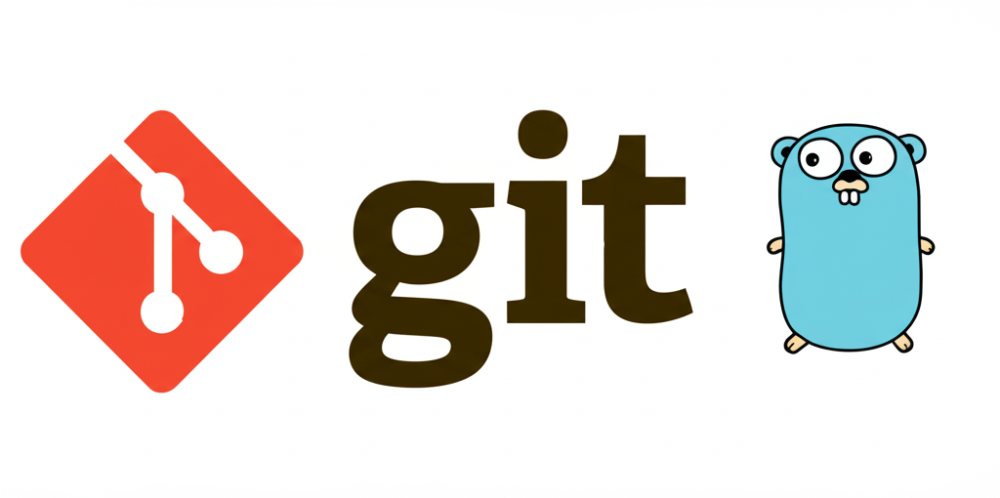

# Gia 🤖

<div align="center">



**AI-powered Git commit assistant using Google's Gemini API**

[](https://golang.org)
[](https://opensource.org/licenses/MIT)
[](https://goreportcard.com/report/github.com/ffelipelimao/gia)
[](https://pkg.go.dev/github.com/ffelipelimao/gia)

</div>

## ✨ Features

- 🤖 **AI-Powered Commit Messages**: Generate meaningful commit messages using Google's Gemini API
- 🔄 **Interactive Interface**: Choose to accept, regenerate, or edit generated messages
- ⚡ **Fast & Lightweight**: Built in Go for optimal performance
- 🎯 **Smart Diff Analysis**: Automatically analyzes your `git diff` for context
- 🛠️ **Easy Integration**: Simple CLI tool that works with any Git workflow

## 🚀 Quick Start

### Prerequisites

- Go 1.21 or higher
- Git
- Google AI Studio API key

### Installation

#### From Source
```bash
go install github.com/ffelipelimao/gia@latest
```

#### From Binary (Coming Soon)
Download the latest release for your platform from the [releases page](https://github.com/ffelipelimao/gia/releases).

### Configuration

Set up your environment variables:

```bash
# Add to your ~/.bashrc, ~/.zshrc, or ~/.profile
export GEMINI_API_KEY="your_api_key_here"
export GEMINI_PROMPT="your_custom_prompt_for_commit_generation"
```

**Get your API key**: Visit [Google AI Studio](https://makersuite.google.com/app/apikey) to create your Gemini API key.

## 📖 Usage

### Generate AI Commit Messages

```bash
# Using the full command
gia commit

# Using the shorthand alias
gia c
```

### Interactive Workflow

1. **Stage your changes**: `git add .`
2. **Run Gia**: `gia commit`
3. **Choose your option**:
   - `a` - Accept and commit
   - `r` - Regenerate message
   - `q` - Quit without committing

### Example Session

```bash
$ gia commit

📝 Generated commit message:
feat: add user authentication system with JWT tokens

Options:
  [a] Accept and commit
  [r] Regenerate message
  [q] Quit

Choose an option: a
✅ Commit executed successfully!
```

### Help

```bash
# General help
gia --help

# Command-specific help
gia commit --help
gia c --help
```

## 🛠️ Development

### Prerequisites

- Go 1.21+
- Git

### Local Setup

1. **Clone the repository**
   ```bash
   git clone https://github.com/ffelipelimao/gia.git
   cd gia
   ```

2. **Install dependencies**
   ```bash
   go mod download
   ```

3. **Build the project**
   ```bash
   go build -o gia .
   ```

4. **Run tests**
   ```bash
   go test ./...
   ```

### Project Structure

```
gia/
├── gia.go              # Main application entry point
├── go.mod              # Go module definition
├── internal/
│   ├── ai/             # AI client and request handling
│   ├── commands/       # CLI command implementations
│   └── exec/           # Execution utilities
└── image/              # Project assets
```

## 🤝 Contributing

We welcome contributions from the community! Here's how you can help:

### Before You Start

1. Check existing [issues](https://github.com/ffelipelimao/gia/issues) to see if your idea has already been discussed
2. For new features, please open an issue first to discuss the implementation

### Development Workflow

1. **Fork the repository**
2. **Create a feature branch**
   ```bash
   git checkout -b feat/your-feature-name
   ```
3. **Make your changes**
4. **Run tests and checks**
   ```bash
   go test ./...
   go fmt ./...
   go vet ./...
   ```
5. **Commit your changes** (using Gia, of course!)
   ```bash
   gia commit
   ```
6. **Push and create a Pull Request**

### Code Style Guidelines

- Follow Go conventions and use `gofmt`
- Write meaningful commit messages
- Add tests for new functionality
- Update documentation when needed
- Keep functions and variables descriptive

### Commit Message Convention

We use conventional commits. When contributing, please use Gia to generate commit messages, which will follow this format:

- `feat:` for new features
- `fix:` for bug fixes
- `docs:` for documentation changes
- `style:` for formatting changes
- `refactor:` for code refactoring
- `test:` for adding tests
- `chore:` for maintenance tasks

## 📄 License

This project is licensed under the MIT License - see the [LICENSE](LICENSE) file for details.

## 🔒 Security

**Important**: Never commit API keys or sensitive credentials to version control. Always use environment variables for configuration.

## 🙏 Acknowledgments

- [Cobra](https://github.com/spf13/cobra) for the excellent CLI framework
- [Google Gemini API](https://ai.google.dev/) for AI capabilities
- All contributors who help improve this project

## 📞 Support

- 🐛 **Bug Reports**: [Create an issue](https://github.com/ffelipelimao/gia/issues)
- 💡 **Feature Requests**: [Create an issue](https://github.com/ffelipelimao/gia/issues)
- 📖 **Documentation**: Check this README and inline code comments
- 💬 **Discussions**: [GitHub Discussions](https://github.com/ffelipelimao/gia/discussions)

---

<div align="center">


[⭐ Star this repo](https://github.com/ffelipelimao/gia) if you found it helpful!

</div>