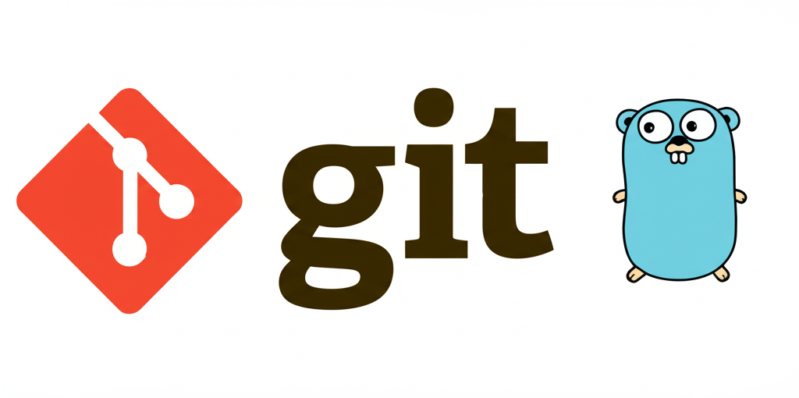

# Gia

<div align="center">



**AI-powered Git commit assistant**

[](https://golang.org)
[](https://opensource.org/licenses/MIT)
[](https://goreportcard.com/report/github.com/ffelipelimao/gia)
[](https://pkg.go.dev/github.com/ffelipelimao/gia)

</div>

## Features

- **AI-Powered Commit Messages and Branch Creation**: Generate meaningful commit messages and consistency branch names
- **Interactive Interface**: Choose to accept, regenerate, or edit generated messages
- **Fast & Lightweight**: Built in Go for optimal performance
- **Smart Diff Analysis**: Automatically analyzes your `git diff` for context
- **Easy Integration**: Simple CLI tool that works with any Git workflow

## Quick Start

### Prerequisites

- Go 1.21 or higher
- Git
- Google AI Studio API key

### Installation

#### From Source
```bash
go install github.com/ffelipelimao/gia@latest
```
Added your GOBIN into PATH
```bash
export PATH="$PATH:$(go env GOPATH)/bin"
```

#### From Binary (Coming Soon)
Download the latest release for your platform from the [releases page](https://github.com/ffelipelimao/gia/releases).

### Configuration

Set up your environment variables:

#### Google Studio API to gemini

```bash
# Add to your ~/.bashrc, ~/.zshrc, or ~/.profile
export GEMINI_API_KEY="your_api_key_here"
export GEMINI_PROMPT="your_custom_prompt_for_commit_generation"
export GEMINI_BRANCH_PROMPT="your_custom_prompt_for_branch_generation"
```
**Get your API key**: Visit [Google AI Studio](https://makersuite.google.com/app/apikey) to create your Gemini API key.

#### AWS Credentials to Bedrock
```bash
aws configure
```

## 📖 Usage

#### Stage your changes: 

`git add .`

### Generate AI Commit Messages

```bash
# Using the full command to use gemini
gia commit gemini

# Using the full command to use bedrock
gia commit bedrock

# Using the shorthand alias
gia c gemini

# Using the default
gia c gemini
```
### Generate AI Branch 

```bash
# Using the full command
gia branch

gia b
```

### Help

```bash
# General help
gia --help

# Command-specific help
gia commit --help
gia c --help
```

## 🤝 Contributing

We welcome contributions from the community! Here's how you can help:

### Before You Start

1. Check existing [issues](https://github.com/ffelipelimao/gia/issues) to see if your idea has already been discussed
2. For new features, please open an issue first to discuss the implementation


## License

This project is licensed under the MIT License - see the [LICENSE](LICENSE) file for details.

## Security

**Important**: Never commit API keys or sensitive credentials to version control. Always use environment variables for configuration.


<div align="center">


[⭐ Star this repo](https://github.com/ffelipelimao/gia) if you found it helpful!

</div>
